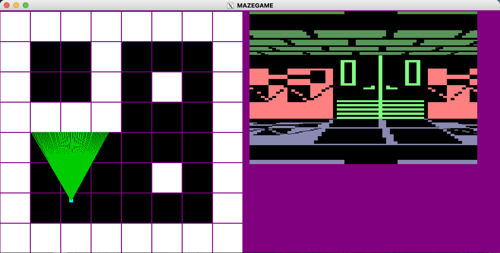

<h1 align="center">MAZEGAME</h1>
<h1 align="center">This is a C project focused on Raycasting</h1>

    

---------
## Description

This repository contains the files to launch a **A First Person's view Game** with the aid of **Raycasting**, It's respective data collection and arrangement to setup and manage a **3D Maze Environment**. It uses seperated functions which are connected to various motion, interaction and view operations, It is reasonably short and easy to comprehend.

This **MazeGame** is a mini project written in C programming language that gives the user a virtual interface well laced with critical functionalities enabling robust movement and interactions.

## The MAZEGAME provides the following features:

* **getRad()** - This function converts the angle to Radian
* **fixAngle()** - This function helps to correct the given Angle
* **main()** - This is the entry point
* **resize** - Ensures that scaling is constant within the screen to avoid distortion
* **buttonUp() & buttonDown()** - Ensures the functionality of the controlling keys, detecting when pressed or released
* **display()** - This function renders the map and 3D images to the screen
* **init()** - This function initializes the game setup
* **drawRays()** - This function construct the rays which helps in navigating through the game and constructing the 3D planes
* **drawPlayer()** - This function draws the player/camera and details the start point and movements
* **drawMap()** - This function constructs various aspect of the maps, from the floor, walls and ceiling as well as their orientation
* **distance()** - This function helps set boundaries and detect walls and obstacles to prevent passing through instead initiates a rub off

## Getting Started

Simply run the Makefile: <b>make</b>

Make use of <b>wasd</b> for controls and <b>o</b> to open doors

    

### Dependecies
install OpenGl library
for Macbook  Install **XQuartz** which allows running X11-based applications 

### AUTHOR
*Kelvin Maccarthy* - [@Captncarty](https://github.com/Captncarty)
